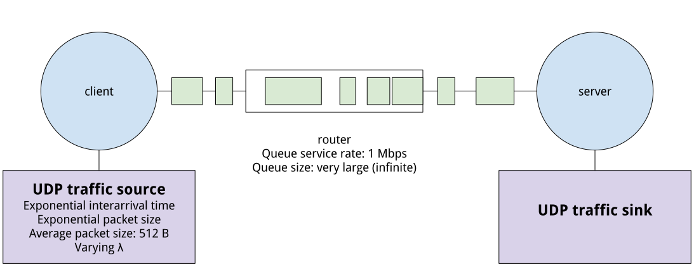
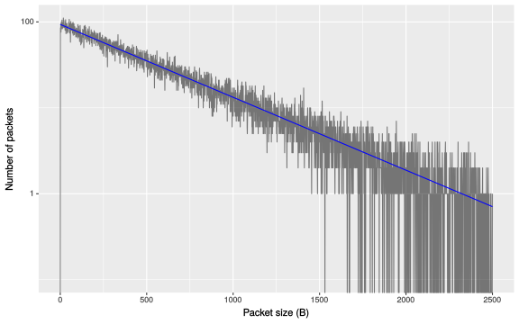

## Simulation experiment

We know that some common mistakes made by experimenters include:

* failure to validate the model/experiment parameters, especially "hidden defaults" in simulation platforms
* failure to set up a valid random experiment

We are going to see the impact of these mistakes in a basic _simulation_ experiment involving an M/M/1 queue.


### Background

In this experiment, we're going to use a simulation experiment to measure the average queue length in the following scenario:



We know that the mean number of packets in this system is given by ρ/(1−ρ), where ρ=λ/μ and λ and μ are the rate at which packets arrive at the queue (in packets/second) and the rate at which packets may be served by the queue (in packets/second). (In our experiment, the distribution of μ comes from variations in the size of packets arriving at the queue, which has a constant service rate in bits/second - μ is computed by dividing the queue service rate in bits/second by the average packet size in bits.)

From the mean number of packets in the system, we can compute the mean number of packets in the queue by substracting the mean number of packets in service: ρ/(1−ρ)−ρ=ρ^2/(1−ρ). This is the result we will try to confirm with a simulation experiment.

### Basic experiment on ns2

In this experiment, you'll set up a basic M/M/1 queue on ns2. You won't have to develop an ns2 simulation from scratch, but you will need to understand a little bit about how it works, and modify an existing simulation. To help you, please read:

* Chapter 2 of these [ns2 lecture notes](https://www-sop.inria.fr/members/Eitan.Altman/COURS-NS/n3.pdf), "ns Simulator Preliminaries"
* Chapter 10 of these [ns2 lecture notes](https://www-sop.inria.fr/members/Eitan.Altman/COURS-NS/n3.pdf), "Classical queuing models". This chapter includes a script for a simulation of an M/M/1 queue, which we're going to use as the base for our simulation.


When you are ready to start, create a new slice on the GENI portal. Reserve a single host, using any InstaGENI aggregate. When it boots, use SSH to log in to your host.

Install the ns-2 simulator with

```
sudo apt-get update # refresh local information about software repositories
sudo apt-get -y install ns2 # install ns2 network simulator
```

Then, download and run the script - 

```
wget https://www-sop.inria.fr/members/Eitan.Altman/COURS-NS/TCL+PERL/mm1.tcl # download the script
ns mm1.tcl # run it
```

(you may safely ignore errors about "the right version of tclsh"). When it finishes, run

```
ls
```

to verify that the output files have been created. 

This script produces two output files: "out.tr" and "qm.out". The "out.tr" file is known as a "trace file," and its format is described [here](https://www.isi.edu/nsnam/ns/doc/node289.html). (Chapter 3 of the [ns2 lecture notes](https://www-sop.inria.fr/members/Eitan.Altman/COURS-NS/n3.pdf) also describes how to process trace files using standard Linux tools like `awk` and `grep`.)

The "qm.out" file is a trace file that specifically monitors the queue. Its columns are:

1. Time,
2. From node,
3. To node,
4. Queue size (B),
5. Queue size (packets),
6. Arrivals (packets),
7. Departures (packets),
8. Drops (packets),
9. Arrivals (bytes),
10. Departures (bytes),
11. Drops (bytes)


We are mainly interested in the mean value of the fifth column (queue occupancy in packets) - we can use `awk` to compute this directly. Run

```
cat qm.out | awk  '{ sum += $5 } END { if (NR > 0) print sum / NR }' 
``` 

to find this value.

### Setting experiment parameters

Having run the experiment with its default paramaters, now we will modify the values in the script to match a specific scenario - 1 Mbps bottleneck link, exponentially distributed packet size with 512 B average, and exponentially distributed interarrival time with mean arrival rate 200 packets/second. (Later, we will run a testbed experiment with the same parameters). Use

```
nano mm1.tcl
```

to open the file for editing, and then make the following changes:

* queue service rate should be 1 Mbps - in the line `set link [$ns simplex-link $n1 $n2 100kb 0ms DropTail]`, change `100kb` to `1Mb`
* average packet size should be 512 Bytes - modify two lines: change the numerator in `$pktSize set avg_ [expr 100000.0/(8*$mu)]` to the new link rate, `1000000.0`, and change the value in `set mu 33.0` from `33.0` to `244.14`. 
* set the rate at which packets arrive to 200 packets per second - modify the line `set lambda 30.0` and change the value from `30.0` to `200.0`.

When you have made these changes, use Ctrl+O to write out the file (and Enter to confirm the file location), and then Ctrl+X to exit `nano`. Then, run the experiment again

```
ns mm1.tcl # run it
```

and get the mean value of queue occupancy in packets:

```
cat qm.out | awk  '{ sum += $5 } END { if (NR > 0) print sum / NR }' 
``` 

Compare the value measured by your simulation experiment with the value predicted by the analytical model.

### Compare simulation and analytical model 


The analytical model tells us about the behavior of the queue as ρ varies. We will attempt to confirm this by simulation - we will vary ρ and measure the effect on mean queue occupancy.

To make it easier to run, we will modify the script so that `lambda` is passed as a command line argument. Change the `set lambda` line to read

```
set lambda [lindex $argv 0] 
```

Then, you will run the script with a single argument - the value of λ, such as 

```
ns mm1.tcl 200.0
```

Run the `ns2` script and find the mean value of queue occupancy for the following values of λ: 225.0, 200.0, 175.0, 150.0, 125.0. (Note that λ must be a float value, so you must include the .0 at the end.)


Plot the results: in a single plot, put ρ on the x-axis, and mean queue occupancy on the y-axis. Make the y-axis a log10 scale. Plot each of the six simulation results as a point, and plot the prediction of the analytical model as a line.

**Lab report**: Create a plot, and also make a table of values (like the one here, but with values filled in to each cell):

| ρ  | Mean queue occupancy - simulation | Mean queue occupancy - analytical model |
| ------------- | ------------- | ------------- |
| .. | .. | .. | ..
| .. | .. | .. | ..

**Lab report**: Are the simulation results consistent with what is predicted by the analytical model? If not, to what can you attribute the difference?

**Lab report**: In answer to the previous question, you propose a reason for the difference between the analytical and simulation results. What experiment can you run to _validate_ your proposed reason? (For example: if you suggest that the difference is due to the random variation of the packet sizes and interarrival times, then by running the experiment for a longer duration, you can see whether that is actually the reason. If the experiment is run for a longer duration, the effect of randomness should be smoothed out.)


### Validating experiment parameters

In our first experiment (with μ=244.14), we assume that:

* The packet sizes are exponentially distributed with mean size 512 bytes, so that the mean service rate at the router is exponentially distributed with mean 244.1 packets/second.
* The traffic is Poisson with λ = 200 packets/second (at least, for the initial experiment).
* The queue capacity is effectively infinite (i.e. no packets are dropped).

Now, we will try and validate how well these assumptions are realized in our experiments. 

We're going to repeat our initial "basic" experiment, but we want to make sure enough packets are generated to validate the probabilistic distribution - so change the line `$ns at 1000.0 "finish"` to `$ns at 10000.0 "finish"`, making the experiment 10x longer. 

Then repeat that first experiment:

```
ns mm1.tcl 200.0
```

Then, from the trace file, extract the timestamp and size of each received packet:

```
cat out.tr | grep "r" | cut -f2,6 -d' ' > packets.dat
```

Transfer this "packets.dat" to your laptop (e.g. with `scp`.) Then, create a plot showing the distribution of packets sizes compared to the expected distribution, as follows:

* put "Packet size in bytes" on the x-axis 
* put "Number of packets of this size observed" on the y-axis 
* Use a log10 scale for the y-axis, and a range of 0 to 2500 B on the x-axis 
* On top of this plot, draw a line showing the number of packets of each size that you expect to observe if packet sizes are exponentially distributed with mean 512 B.

If our packets were generated according to an exponential distribution with mean 512 B, we would expect to see something like this:



**Lab report**: Show the plot of actual vs. expected packet size. Comment on your observations.

You should have noticed that the distribution is truncated at the top end. The [ns2 lecture notes](https://www-sop.inria.fr/members/Eitan.Altman/COURS-NS/n3.pdf) explain the reason - a secret default value in the simulation platform! - and how to fix it:

> The simulated packets turn out to be truncated at the value of 1kbyte, which is the default size of a UDP packet. Thus transmission times are a little shorter than we intend them to be. To correct that, one should change the default maximum packet size, for example to 100000. This is done by adding the line 
>
> ```
> $src set packetSize_ 100000
> ```
> 
> after the command `set src [new Agent/UDP]`.

Make this change to your simulation script, then repeat the experiment and plot the actual vs. expected packet sizes. 

**Lab report**: Show the new plot of actual vs. expected packet size. Comment on your observations.

Next, we will consider the packet interarrival time for our simulation experiment. We expect a mean interarrival time of 0.005 second (1/200 packets/second). Compute the observed mean interarrival time using the timestamps of received packets in the output file - how close is it to 0.005 seconds? Also create a plot showing the expected and observed distribution:

* Find out the frequency of each interarrival time in the trace in 0.001 second bins. 
* Plot these frequencies: put "Interarrival time in seconds" on the x-axis and "Number of packets of this size observed" on the y-axis. 
* Use a log10 scale for the y-axis, and a range of 0 to 0.1 seconds on the x-axis. 
* On top of this plot, draw a line showing the expected number of packets of each size if interarrival times are exponentially distributed with mean 0.005 seconds. 

**Lab report**: Show your plot of actual vs. expected interarrival times. Comment on your observations.

Third, validate the assumption that the queue size is effectively infinite - at least, for this experiment. In the "out.tr" file, look for lines beginning with a "d" - indicating dropped packets. Also check the last line of the queue monitor output file, and see if any packets are reported as being dropped (8th column in the "qm.out" file.)

**Lab report**: Were any packets dropped in your experiment? What changes would you make to the experiment to avoid packet drops, if you saw any?

### Repeating the experiment

Now that we have made some changes to our script, we will try to confirm the analytical model again. Run the `ns2` script and find the mean value of queue occupancy for the same values of λ: 225.0, 200.0, 175.0, 150.0, 125.0. 


Plot the results: in a single plot, put ρ on the x-axis, and mean queue occupancy on the y-axis. Make the y-axis a log10 scale. Plot each of the six simulation results as a point, and plot the prediction of the analytical model as a line.

**Lab report**: Show your plot, and also include a table of values (like the one here, but will values filled in to each cell):

| ρ  | Mean queue occupancy - simulation | Mean queue occupancy - analytical model |
| ------------- | ------------- | ------------- |
| .. | .. | .. | ..
| .. | .. | .. | ..


**Lab report**: Are the simulation results consistent with what is predicted by the analytical model?

**Lab report**: In your previous attempt to run this experiment, you saw a _systematic bias_ in the results - the simulation results tended to show a larger queue occupancy than the predictions of the analytical model. What was the reason for this systematic bias? Would you expect to see a systematic bias if the difference between analytical and simulation results was due to random variation?


### Creating independent random experiments

Finally, we want to be able to run multiple trials as independent random experiments. 

Run the script a few times and look at the trace files. Are these separate runs independent trials, or are the interarrival times and packet sizes identical on each run?

To get statistically independent trials, we will need to seed the random number generator with a different value each time we run the experiment. Also, we will want to set up the two distributions in the experiment (packet interarrival time and packet size) to be statistically independent, using different substreams of the random number generator.

To do this, add a few lines immediately after `set ns [new Simulator]`:

```
set rep [lindex $argv 1]

set rng1 [new RNG]
set rng2 [new RNG]

for {set i 1} {$i<$rep} {incr i} {
        $rng1 next-substream;
        $rng2 next-substream
}
```

The first line says to take a _second_ argument from the command line and store it in the variable "rep". (Recall that we are already passing `lambda` as the first command line argument.) We then create two random number generator objects. Then, we explicitly set them to use different random substreams of the ns2 random number generator, using `next-substream`. We use the "rep" value passed from the command line to determine how many times to call `next-substream`, so that simulations run with different values of "rep" will have different random numbers.

We still need to assign the random number generator objects to the distributions that they will feed. Underneath the line

```
set InterArrivalTime [new RandomVariable/Exponential]
```

add

```
$InterArrivalTime use-rng $rng1
```

and underneath


```
set pktSize [new RandomVariable/Exponential]
```

add

```
$pktSize use-rng $rng2
```

Now, you will run your simulation with another argument, e.g.

```
ns mm1.tcl 200.0 1
```

where independent results will be generated when you supply different values for the second argument. 

Run your script with different values of "rep" - try all the integer values in the range 1-5 - and compute the mean queue occupancy for each. Verify that different values of "rep" give different results.

Note: ns2 uses a multiple recursive generator called MRG32k3a, which contains streams from which numbers picked sequentially seem to be random, uniformly distributed. These in turn are transformed to create variates of other desired distributions. More information about the current random number generator in ns2 is available [here](http://www.isi.edu/nsnam/ns/doc/node267.html).


**Lab report**: Complete this table again for these values of λ: 225.0, 200.0, 175.0, 150.0, 125.0. But in the "Mean queue occupancy - simulation" column, fill in the mean result across all repetitions from 1-5 for that value of ρ, *and* in parentheses, the standard deviation of the mean across all repititions from 1-5 for that value of ρ.


| ρ  | Mean queue occupancy - simulation | Mean queue occupancy - analytical model |
| ------------- | ------------- | ------------- |
| .. | .. | .. | ..
| .. | .. | .. | ..
